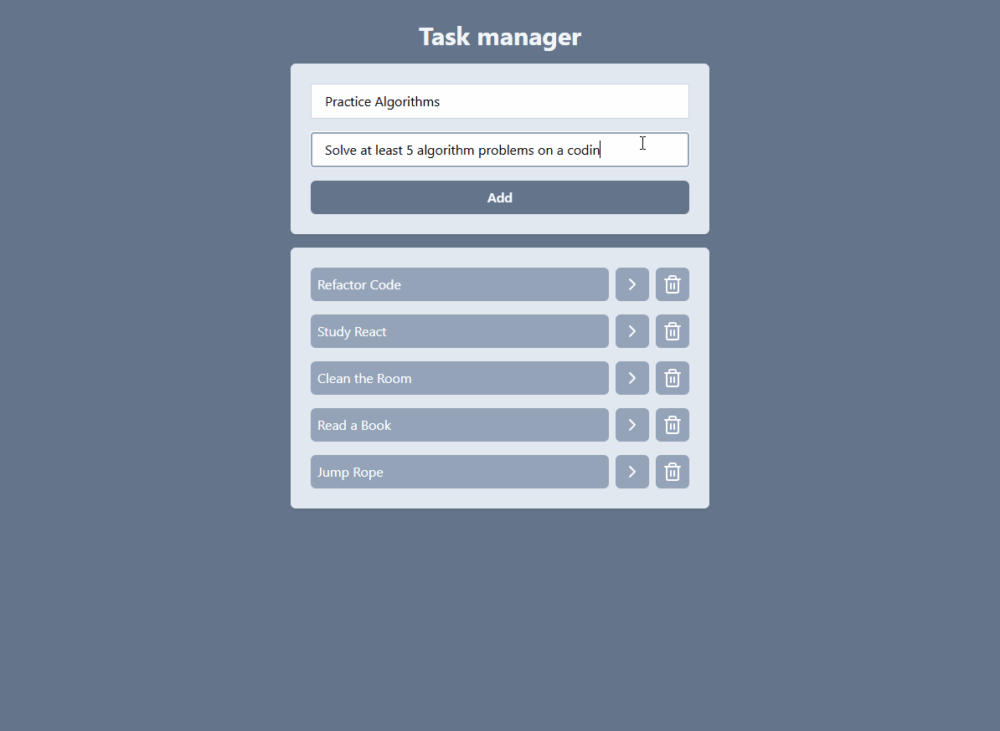

# Task Manager

This is a task manager designed to help you organize your daily activities.

## Glossary

- [Overview](#overview)
  - [About](#about)
  - [Screenshots](#screenshots)
- [How to Run the Project](#how-to-run-the-project)
  - [Developed with](#developed-with)
- [Autor](#autor)

## Overview

### About

This website is a task manager that allows users to add tasks with names and descriptions, mark them as completed, remove them, and expand them to view more details.

### Screenshots

#### Example of the website



## How to Run the Project

To run the project locally, follow these steps:

1. Clone the repository:

   ```bash
   git clone "https://github.com/itsdavss/task-manager"

   ```

2. Navigate to the project folder:

   ```bash
   cd task-manager

   ```

3. Install the dependencies:

   ```bash
   npm install

   ```

4. Start the development server:
   ```bash
   npm run dev
   ```

### Developed with

- React
- React Router

## Autor

- GitHub - [itsdavss](https://github.com/itsdavss)
- My portfolio - [Davi Oliveira](https://itsdavss.github.io/portfolio-davi/)
- LinkedIn - [Davi Oliveira dos Santos](https://www.linkedin.com/in/davi-oliveira-dos-santos/)
